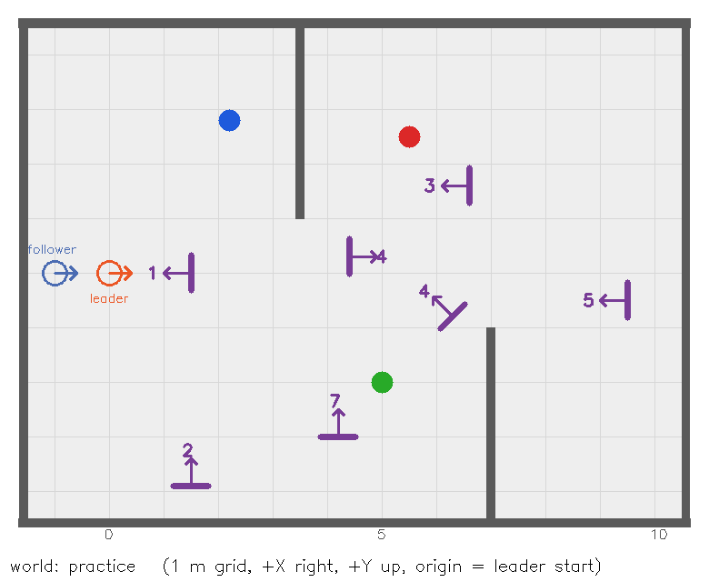

# Clue Chain Hunt — Starter Package

**Robotics Club, IIT Guwahati · Inter IIT Tech Meet 15.0 Bootcamp**

**Stack:** Ubuntu 22.04 · ROS 2 Humble · Gazebo Fortress · Nav2 · slam_toolbox · OpenCV

Read the problem statement PDF first. This README tells you how to install, run and use the
simulation you will build your solution on.



---

## 1. What is in this package

```
Clue_Chain_Hunt_Bootcamp/
├── README.md                    ← this file
├── Clue_Chain_Hunt_PS.pdf       problem statement
├── docs/                        arena picture, a sample clue board, the leader's tag
├── clue_hunt_description/       the two robots (URDF/xacro + sensors)       - do not modify
├── clue_hunt_gazebo/            practice world + simulation launch           - do not modify
├── clue_hunt_navigation/        slam_toolbox + Nav2 configs and launch files - you may tune copies
└── clue_hunt_solver/            YOUR package - leader + follower node templates
```

During evaluation **we use our own copies** of `clue_hunt_description` and `clue_hunt_gazebo`,
plus **hidden worlds**. Anything you change there will be lost. Put all your code, and any tuned
Nav2 or SLAM parameter files, inside `clue_hunt_solver`.

---

## 2. Install (once)

Follow the **Installation Guide (Ubuntu 22.04 + ROS 2 Humble + Gazebo)** PDF in the Drive folder first.
Then make sure you have every package this task needs:
```bash
sudo apt update
sudo apt install -y \
  ros-humble-ros-gz ros-humble-xacro ros-humble-robot-state-publisher \
  ros-humble-navigation2 ros-humble-nav2-bringup ros-humble-nav2-simple-commander \
  ros-humble-slam-toolbox ros-humble-teleop-twist-keyboard \
  ros-humble-cv-bridge ros-humble-rqt-image-view ros-humble-tf2-tools \
  python3-opencv python3-numpy
```
`ros-humble-ros-gz` installs **Gazebo Fortress**. Check it with `ign gazebo --version` (should be 6.x).

## 3. Build

```bash
mkdir -p ~/hunt_ws/src ~/hunt_ws/maps
cp -r Clue_Chain_Hunt_Bootcamp/clue_hunt_* ~/hunt_ws/src/
cd ~/hunt_ws
source /opt/ros/humble/setup.bash
colcon build --symlink-install
source install/setup.bash
```
Run `source ~/hunt_ws/install/setup.bash` in **every new terminal**, or add it to `~/.bashrc`.

---

## 4. The robots

| | **Leader** (orange) | **Follower** (blue) |
|---|---|---|
| Gazebo model name | `hunter` | `follower` |
| Spawn pose | (0, 0), facing +X | (−1, 0), facing +X |
| Drive | diff drive, `/cmd_vel` | diff drive, `/follower/cmd_vel` |
| Odometry | `/odom` | `/follower/odom` |
| Camera 640×480, 60° HFOV, 15 Hz | `/camera/image_raw`, `/camera/camera_info` — **tilted 5° down** | `/follower/camera/image_raw`, `/follower/camera/camera_info` — **tilted 8° up** |
| LiDAR 360°, 0.12–12 m, 10 Hz | `/scan` | — none — |
| IMU 100 Hz | `/imu` | — none — |
| TF frames | `odom`, `base_footprint`, `base_link`, `lidar_link`, `camera_link`, `cam_optical_link`, `imu_link`, `tag_link` | the same names with a `follower/` prefix, e.g. `follower/odom`, `follower/cam_optical_link` |
| Special | ArUco tag on its back: **DICT_4X4_50, id 49, 0.12 m**, centre 0.30 m above the floor, 0.21 m behind the robot centre | — |

Base size is 0.40 × 0.30 m, wheel radius 0.06 m, wheel separation 0.34 m.
Both robots publish TF on the shared `/tf` topic.

```
Leader :  map ─► odom ─► base_footprint ─► base_link ─┬─► lidar_link
          (AMCL)  (wheels)                              ├─► imu_link
                                                        ├─► tag_link
                                                        └─► camera_link ─► cam_optical_link
Follower: follower/odom ─► follower/base_footprint ─► follower/base_link ─► follower/camera_link ─► follower/cam_optical_link
```
The leader spawns at the world origin, so the leader's **map frame = the Gazebo world frame**.

## 5. The arena and the clue boards

- The arena is 12 × 9 m (x from −1.5 to 10.5, y from −4.5 to 4.5), with two inner walls and three
  coloured pillars (**RED, GREEN, BLUE**; radius 0.2 m, height 1 m). The hidden worlds keep the
  **same walls and pillar positions** but may **swap the pillar colours**, move every board and
  the treasure, and change the lighting.
- **Clue board:** 0.64 m wide, 0.37 m tall. Its printed face has an **ArUco** marker on the left
  (DICT_4X4_50, 0.24 m) and a **QR code** on the right (centre 0.30 m to the reader's right of the ArUco centre).
  Sample: `docs/board_example.png`.
- **Board frame:** +X points out of the printed face, Z is up, and +Y = +X rotated 90° anticlockwise
  (the reader's right). The origin is the **ArUco centre**.

**Clue text:** `HUNT:<id>:<token>:[TREASURE ]<command>`

| Command | Meaning |
|---|---|
| `GOTO x y` | next board is at (x, y) in the map frame (board 1 only) |
| `PILLAR C` | next board is within 1.8 m of the pillar of colour C |
| `BETWEEN A B f` | next board is within 1.8 m of the point A + f·(B − A), where A and B are pillar centres |
| `REL a b` | next target = ArUco centre + a·(board +X) + b·(board +Y) |
| `TREASURE REL a b` | the treasure (a gold disc on the floor) is at that point |

**Chain token:** `token` = first 4 hex characters (upper case) of SHA-1 of the **previous** valid clue
text. For board 1, use the string `START`.
```python
import hashlib; hashlib.sha1(prev_text.encode()).hexdigest()[:4].upper()     # 'START' -> '7196'
```
Some boards are traps:
- **Decoys** have an id that is not the next one in the chain.
- **Look-alikes** carry the **same id** as a real board, but a wrong token.

Reading either one gives you a wrong clue, and claiming it costs points.

---

## 6. Running things

### Simulation
```bash
ros2 launch clue_hunt_gazebo sim.launch.py                 # both robots
ros2 launch clue_hunt_gazebo sim.launch.py follower:=false # leader only
ros2 launch clue_hunt_gazebo sim.launch.py gui:=false      # no Gazebo window (faster)
```
The Technical Board and Robotics Club banner lies on the floor south of the arena. It is outside the
walls, so the cameras never see it.

### Look and drive
```bash
ros2 run rqt_image_view rqt_image_view                    # pick /camera/image_raw or /follower/camera/image_raw
ros2 run teleop_twist_keyboard teleop_twist_keyboard      # drives the leader
ros2 run teleop_twist_keyboard teleop_twist_keyboard --ros-args -r cmd_vel:=/follower/cmd_vel
ros2 run tf2_tools view_frames                            # TF tree -> frames.pdf
```

### Build your map (teleop allowed)
```bash
ros2 launch clue_hunt_navigation mapping.launch.py        # leader only, SLAM + RViz
ros2 run teleop_twist_keyboard teleop_twist_keyboard      # drive everywhere, slowly
ros2 run nav2_map_server map_saver_cli -f ~/hunt_ws/maps/arena
```

### Navigate on your map
```bash
ros2 launch clue_hunt_navigation navigation.launch.py map:=$HOME/hunt_ws/maps/arena.yaml
```
Use **2D Goal Pose** in RViz to test. Then start your solution:
```bash
ros2 launch clue_hunt_solver hunt.launch.py
```

---

## 7. What your code must publish

| Topic | Type | When |
|---|---|---|
| `/hunt/clues` | `std_msgs/String` | each **valid** clue's full text, in chain order |
| `/hunt/boards` | `std_msgs/String` | `"<id> <x> <y>"`: your estimate of that board's ArUco centre in the map frame |
| `/hunt/treasure` | `geometry_msgs/PoseStamped` | once, frame `map`, after the leader has driven onto the treasure |
| `/leader/status` | `std_msgs/String` | optional: `MOVING` / `SEARCHING` / `READING` / `DONE` (your follower may use it) |
| `/follower/cmd_vel` | `geometry_msgs/Twist` | your follower controller |

**Rules for the follower code:** it may use only `/follower/...` topics, TF frames starting with
`follower/`, and `/leader/status`.

**Never use:** Gazebo ground truth (`/model/...`), `ign`/`gz` service calls, or hardcoded board, pillar
or treasure positions.

## 8. Troubleshooting

| Problem | Fix |
|---|---|
| `Package not found` | `source ~/hunt_ws/install/setup.bash` in that terminal |
| Black camera / Gazebo crashes in a VM | `export LIBGL_ALWAYS_SOFTWARE=1`, enable 3D acceleration, or use `gui:=false` |
| Everything slow | `gui:=false`, close RViz, and close other apps (two cameras are heavy) |
| Nav2 waiting for initial pose | Click **2D Pose Estimate** at (0, 0) facing +X |
| Robot doesn't move | Check `ros2 topic echo /cmd_vel`; only one node should publish it |

Questions: contact the coordinators listed in the problem statement. Good luck!
